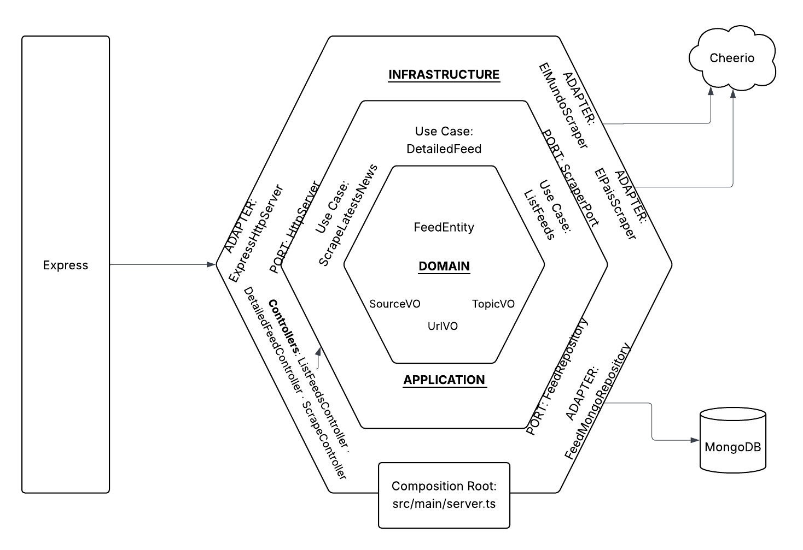

# Daily Trends Service

## Description

This is a service that scrapes the latest news from a given source and stores it in a mongodb database.

## Technologies

- Node.js
- TypeScript
- Express
- Mongoose

## Architecture



## Domain Model


## Quickstart

1) Requirements: Node 20+, pnpm, Docker

2) Copy environment and start services:
```bash
cp env.example .env
docker compose up -d
```

3) Start the API for local development (optional):
```bash
pnpm install
pnpm dev
```

API runs on http://localhost:${HTTP_PORT:-3080}

## Environment

Set via `.env` (defaults in code):
- `MONGO_URI` (default: `mongodb://localhost:27017/daily-trends`)
- `MONGO_DB_NAME` (default: `daily-trends`)
- `HTTP_PORT` (docker-compose mapping; default 3080)
- `NODEJS_DEBUG_PORT` (docker-compose; default 9229)

## Scripts

```bash
pnpm dev           # watch mode (tsx)
pnpm build         # compile TypeScript
pnpm start         # run built app (dist)
pnpm test          # run tests (vitest)
pnpm test:coverage # run tests with coverage
pnpm lint          # run eslint
```

## Endpoints (summary)

- POST `/scrape?source=el_pais&limit=5` → `{ success: boolean }` (returns `true` if any feeds upserted)
- GET `/list?filters={...}` → `[{ title, url, publishedAt }]`
- GET `/detailed-feed?url=https://...` → full feed entity

See `docs/API.md` for detailed schemas and examples.

## Docker

Local dev with hot-reload inside container:
```bash
docker compose up -d
```
Exposed ports:
- API: `${HTTP_PORT:-3080}` → container 3080
- Node inspector: `${NODEJS_DEBUG_PORT:-9229}` → container 9229

MongoDB runs as a replica set `rs0` for development.

## Testing
```bash
pnpm test
```

### Coverage
```bash
pnpm test:coverage
```

Coverage reports are written to `coverage/` (HTML at `coverage/lcov-report/index.html`).
