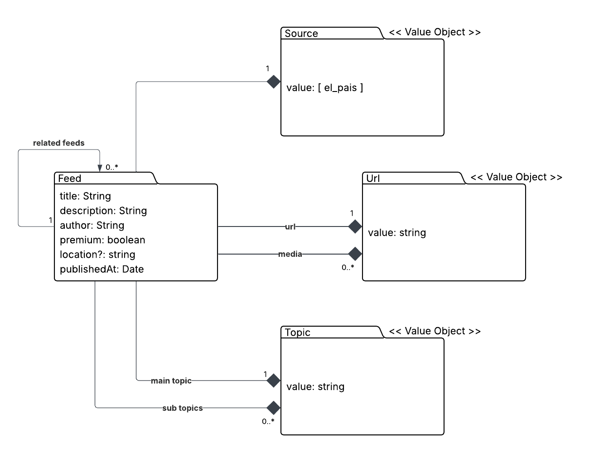

# Daily Trends Service

## Description

This is a service that scrapes the latest news from a given source and stores it in a mongodb database.

## Technologies

- Node.js
- TypeScript
- Express
- Mongoose

## Architecture

//TODO: Insert architecture diagram

## Domain Model



## Installation

```bash
docker compose up -d
```

## Testing
pnpm run test
